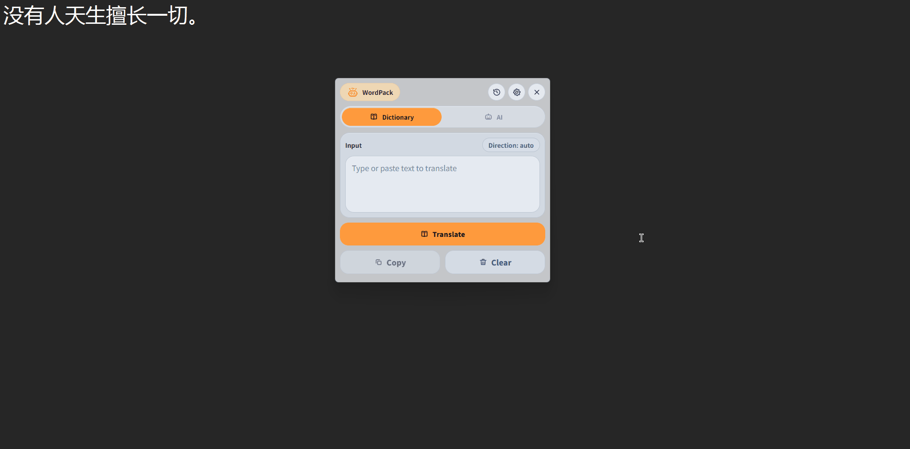
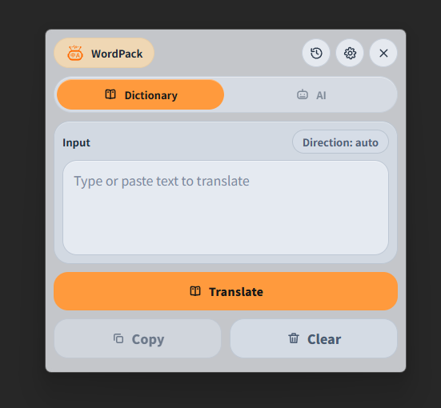
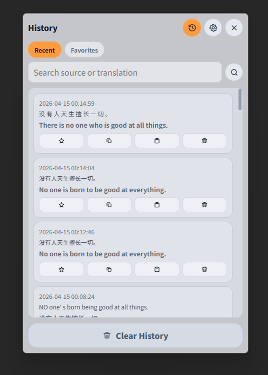
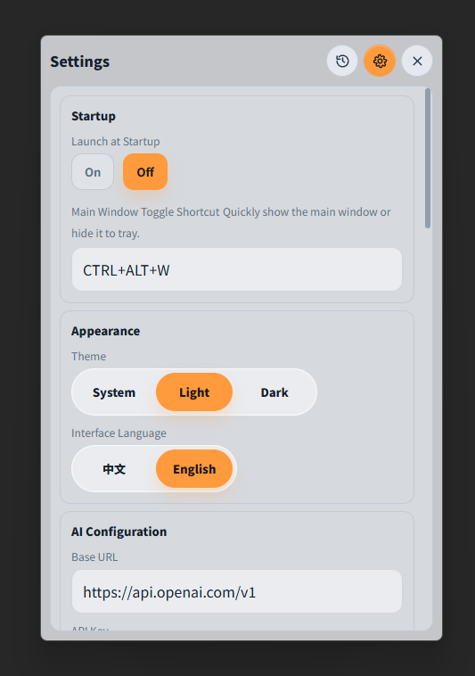
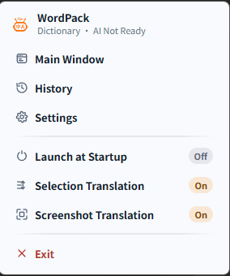

# WordPack

> A Windows desktop translator for high-frequency use: selection translation, screenshot translation, AI translation, and offline dictionary translation.

English | [中文文档](./README.zh-CN.md)

## Usage at a Glance

| Selection Translation | Input Translation | Screenshot Translation |
| --- | --- | --- |
| Select text in any app, then trigger selection translation by your configured mode | Open main window, type/paste text, then translate | Press `Ctrl+Alt+S` (default), drag-select region, get translated output |
|  |  |  |

## Product Demo

### Main Window



### History



### Settings



### Tray Menu



## Features

- Selection translation from any app
- Screenshot translation (capture region -> recognize text -> translate)
- AI translation (configurable endpoint/model)
- Offline dictionary translation via Argos model packages (`.argosmodel`)
- Offline text-to-speech playback (Windows SAPI) for translated text
  - Main window: play/stop toggle in result area
  - Bubble panel: play/stop toggle in result area
  - Zoom panel and History: play translated text with one click
- Tray menu quick actions
- Chinese/English UI

## 3-Minute Quick Start

### 1. Install and run

```powershell
pip install -r requirements.txt
python app.py
```

### 2. Configure AI (optional)

Open **Settings -> AI Configuration**, then set:
- `Base URL`
- `API Key`
- `Model`

### 3. Start using

- Selection translation: select text, then trigger by configured mode
- Screenshot translation: `Ctrl+Alt+S` (default)
- Show/hide main window: `Ctrl+Alt+W` (default)
- Voice playback: click the play icon in translated result areas to read text aloud

## Configuration

Runtime data directory:
- Source run: `<repo>/data`
- Packaged app: `<install_dir>/data`
- Fallback (packaged, not writable): `%LOCALAPPDATA%\WordPack\data`
- Override: `WORDPACK_DATA_DIR`

Important config keys:
- `ui_language`: `zh-CN` / `en-US`
- `translation_mode`: `dictionary` / `ai`
- `openai.base_url`, `openai.api_key`, `openai.model`
- `interaction.screenshot_hotkey`, `interaction.main_toggle_hotkey`

## Build and Packaging

Outputs:
- App folder: `dist/WordPack`
- Installer: `dist/installer/WordPack-Setup.exe`

```powershell
# Full clean build
powershell -ExecutionPolicy Bypass -File .\scripts\build_release.ps1 -Clean

# Installer only (reuse dist/WordPack)
powershell -ExecutionPolicy Bypass -File .\scripts\build_release.ps1 -InstallerOnly

# Offline installer
powershell -ExecutionPolicy Bypass -File .\scripts\build_release.ps1 -WithOfflineInstaller
```

Notes:
- Inno Setup 6 (`ISCC.exe`) is required for installer generation
- WebView2 runtime is required to run the app

## Development

```powershell
powershell -ExecutionPolicy Bypass -File .\scripts\run_dev.ps1
```
