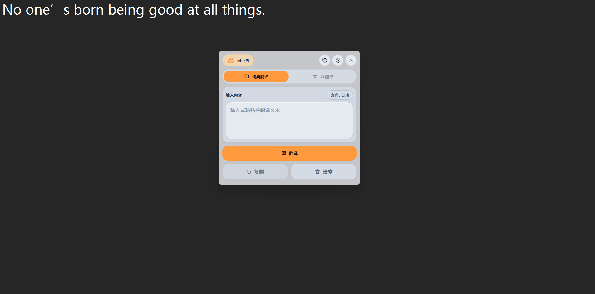
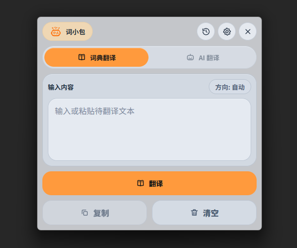
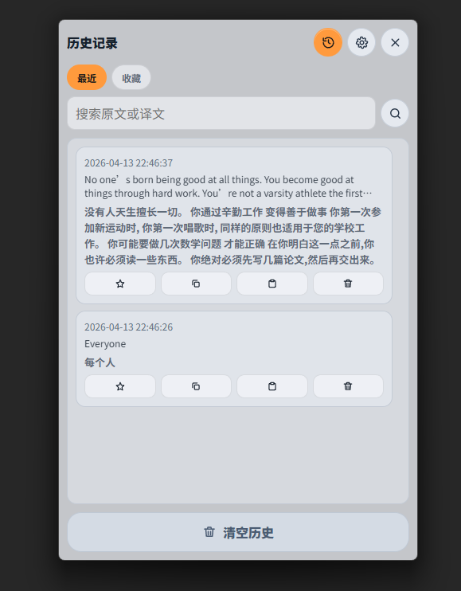
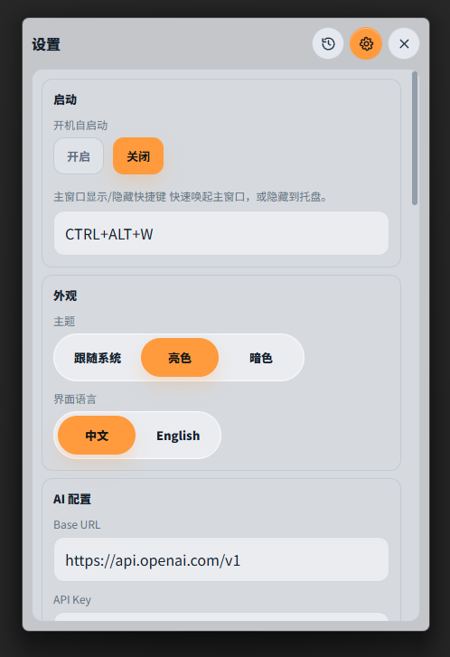
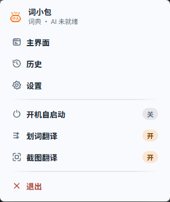

# 词小包 WordPack

> 一个面向高频场景的 Windows 桌面翻译工具：划词翻译、截图翻译、AI 翻译、离线词典翻译。

[English](./README.md) | 中文

## 使用说明

| 划词翻译 | 输入翻译 | 截图翻译 |
| :-- | --- | --- |
| 在任意应用中选中文本后，按当前配置（图标/快捷键）触发划词翻译 | 打开主界面，输入/粘贴文本并翻译 | 默认按 `Ctrl+Alt+S`，框选区域后直接得到翻译结果 |
|  |  |  |

## 产品演示

### 主界面



### 历史



### 设置



### 托盘



## 功能特性

- 任意应用划词翻译
- 截图翻译（框选区域 -> 识别文字 -> 翻译）
- AI 翻译（可配置接口和模型）
- 基于 Argos 模型包（`.argosmodel`）的离线词典翻译
- 托盘菜单快捷控制
- 中英文界面

## 3 分钟快速上手

### 1. 安装并运行

```powershell
pip install -r requirements.txt
python app.py
```

### 2. 配置 AI（可选）

打开 **设置 -> AI 配置**，填写：
- `Base URL`
- `API Key`
- `Model`

### 3. 开始使用

- 划词翻译：选中文本后触发
- 截图翻译：默认 `Ctrl+Alt+S`
- 主界面显隐：默认 `Ctrl+Alt+W`

## 配置说明

运行数据目录：
- 源码运行：`<repo>/data`
- 打包运行：`<install_dir>/data`
- 不可写时回退：`%LOCALAPPDATA%\WordPack\data`
- 可通过 `WORDPACK_DATA_DIR` 覆盖

关键配置项：
- `ui_language`: `zh-CN` / `en-US`
- `translation_mode`: `dictionary` / `ai`
- `openai.base_url` / `openai.api_key` / `openai.model`
- `interaction.screenshot_hotkey` / `interaction.main_toggle_hotkey`

## 构建与打包

产物：
- 程序目录版：`dist/WordPack`
- 安装包：`dist/installer/WordPack-Setup.exe`

```powershell
# 全量构建
powershell -ExecutionPolicy Bypass -File .\scripts\build_release.ps1 -Clean

# 仅构建安装包（复用 dist/WordPack）
powershell -ExecutionPolicy Bypass -File .\scripts\build_release.ps1 -InstallerOnly

# 构建离线安装包
powershell -ExecutionPolicy Bypass -File .\scripts\build_release.ps1 -WithOfflineInstaller
```

说明：
- 生成安装包依赖 Inno Setup 6（`ISCC.exe`）
- 应用运行依赖 WebView2 Runtime

## 开发调试

```powershell
powershell -ExecutionPolicy Bypass -File .\scripts\run_dev.ps1
```
